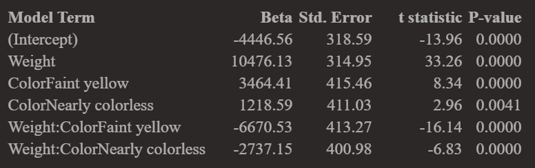

### Upcoming Dates

- **HW 7 is due on Monday, 3/20**. 

   - Grace Period is extended until Wednesday 3/22 at midnight, because of Spring Break.
   
<br>
  
- **Quiz 2 is Thursday, March 30th**

- Today's Lecture (3/9) will include:

  - In-class Exercises using the Animals Data and your HW 7 data to help you make progress.

  - We will also introduce a new dataset about Wine.

---

### Getting Started with Markdown

- Download Zipped R project 

- Open Zipped folder and copy internal folder (R Project) to a BUA 345 folder on your computer NOT IN DOWLOADS

- Click on .Rproj file to open project

- Click on `code_data_output` file to open it.

- Click on `BUA_345_Lecture_15.Rmd` to open it.

- Run Setup Chunk

---

### Setup

* The setup chunk shows the packages needed for this demo.   

* R will install specified packages if needed (only required once after R is installed)  

* R will load specified packaged (required every time you start a new R session)  

* The first time you run this code, R will install these packages which will be slow.  

* **If you get warnings, that's okay.**  

* If you get **error messages**, I (or TA), can help you.

---

### Setup Chunk for Lecture 15

```{r setup for Lecture 15, include = T}

# this line specifies options for default options for all R Chunks
knitr::opts_chunk$set(echo=T, highlight=T)
# suppress scientific notation
options(scipen=100)

# install helper package that loads and installs other packages, if needed
if (!require("pacman")) install.packages("pacman", repos = "http://lib.stat.cmu.edu/R/CRAN/")

# install and load required packages
pacman::p_load(pacman,tidyverse, magrittr, olsrr, gridExtra, ggiraphExtra, knitr, viridis)

# verify packages
p_loaded()

```

**NOTES:

- ** Don't worry about `xaringanthemer` package (required for my slides but not for your code).

- If you are having trouble installing/loading any packages, please come to office hour or make an appointment with me or course TA.

---

### Lecture 15 In-class Exercises - Review Question

#### **Question 1 (L15) - Session ID: bua345s23**

Review Question from HW 6: Recall the 'Diamonds' data.
The Categorical variable, 'Color', has THREE categories:

- `Colorless`
- `Nearly Colorless`
- `Faint yellow`

By default, R chooses a BASELINE category by alphabetical order.

Based on the output shown below, what is the SLR slope for the BASELINE category, 'Colorless' Diamonds?

Recall that the BASELINE category name does not appear in the regression output.

```{r diamonds model param estimates, echo=F}



```


### Review/New Question - Using A Model to get Estimates
#### Animals Data - Predicting Animal Sleep Duration

- Original dataset includes 56 distinct species, including man.

- Notes:

  - Two species of elephants were removed from the analysis.
  
    - Population was limited to animals under 1000 pounds.

  - Natural log (LN) transformed variables were added to original data.
  - Observations with missing values are removed below
  - Working dataset has 49 observations (49 different species)

```{r import data and remove missing values}

# import and examine data
animals <- read_csv("animals.csv", show_col_types=F) |>
  filter(!is.na(LifeSpan) & !is.na(Gestation)) 

```

---

### Glimpse of Animals Data

```{r data glimpse}

animals |> glimpse(width=75)

```

---

### Animals Data Dictionary - Description of Variables

```{r animals data dictionary table, echo=F}

Variable <- names(animals)

Type <- c("Nominal", rep("Quantitative", 8), rep("Ordinal", 3))

Description <- c("Name of Species",
                 "Total Sleep = sum of slow wave and paradoxical sleep (hrs/day)",
                 "Average Body Weight in kilograms",
                 "Natural Log of Body Weight",
                 "Average Brain Weight in grams",
                 "Natural Log of Brain Weight",
                 "Maximum Life Span in years",
                 "Natural Log of Life Span",
                 "Gestation Time in days",
                 "Predation Index (1 = least likely to be preyed upon, 5 = most likely)",
                 "Sleep Exposure Index (1 = least exposed while sleeping, 5 = most exposed",
                 "Overall Danger Index (1 = least danger from other animals, 5 = most most danger")

(animal_data_dictionary = tibble (Variable, Type, Description) |>
  kable())

```

#### Intuitvely, there is likely to be redundancy between `Predation`, `Exposure`, and `Danger`.

---

### Matrix of Scatterplots 

- Like correlation matrices, scatterplot matrices are a useful way to quickly examine all possible predictors.
- First let's look at untransformed quantitative variables.

  - Notice BodyWt, BrainWt, LifeSpan plots all show observations clustered in the corner.
  - That indicates that these dsitributions are skewed and should be log transformed.
  -   Could be verified with histograms

```{r matrix 1}

animal_mat1 <- animals |> select(TotalSleep, 
                                 BodyWt, 
                                 BrainWt, 
                                 LifeSpan, 
                                 Gestation)

pairs(animal_mat1)

```

---

### Scatterplot Matrix of Transformed Variables

- Next is same matrix with the LN transformed variables.

- Notice that distributions look better BUT some variables are highly correlated

  - Recall: If $R_{XY} \geq 0.8$ for two variables, they cannot both be in the model because they are **multicollinear**.

  - `LNBodyWt` and `LNBrainWt` should definitely both NOT be in the final model.

  - `LNBrainWt` and `LNLifeSpan` appear close to the cutoff and should not be in the final model together, if possible.
  
```{r matrix 2}

animal_mat2 <- animals |> select(TotalSleep, 
                                 LNBodyWt, 
                                 LNBrainWt, 
                                 LNLifeSpan, 
                                 Gestation)

pairs(animal_mat2)

animal_mat2 |> cor() |> round(2) |> kable()

```


The correlation matrix shows the numerical values of the correlations we see in the scatterplot.


---

### Scatterplot Matrix of Ordinal Variables

#### Lecture 14 In-class Exercises

#### **Question 4 (L14) - Session ID: bua345s23**

Which two ordinal categorical predictor variables appear to be multicollinear, i.e., highly correlated?

```{r matrix 3}

animal_mat3 <- animals |> select(TotalSleep, 
                                 Predation, 
                                 Exposure, 
                                 Danger)

pairs(animal_mat3)

animal_mat3 |> cor() |> round(2)

```

---

### Backward Elimination

**`1.`** Data examination and transformations completed

**`2.`** Create a full 'saturated' model with all potential predictor variables and interaction terms (This is subjective).

```{r animals full model}

 # convert ordinal variables to factors
animals <- animals |>       
  mutate(PredF = factor(Predation), 
         ExposF = factor(Exposure), 
         DangrF=factor(Danger))

# full model (subjective)
animals_full <- lm(TotalSleep ~ LNBodyWt + LNBrainWt + 
                     LNLifeSpan + Gestation + 
                     PredF + ExposF + DangrF + 
                     LNBodyWt*Gestation + LNLifeSpan*PredF + 
                     LNLifeSpan*ExposF + LNLifeSpan*DangrF, data=animals)

```

---

### Backward Elimination

**`3.`** Use 'Backward Elimination' to pare full model down to a preliminary model.

- We cast a ***wide net*** to start by specifying that erms will remain in model if p-value < 0.1.  

- Note that each category of each factor variable is shown making model look more complex than it is.

```{r animals model backward elim and output}

(animals_BE <- ols_step_backward_p(animals_full, prem = 0.1, progress = T))

```

---

### Backward Elimination - Next Steps

**`4.`** Examine predictors in preliminary model to confirm they are not too highly correlated with each other. 

- If correlation for two variables, $R_{XY} \geq 0.8$, then one variable should be excluded.

- Variables in preliminary model: : `LNBodyWt`, `LNLifeSpan`, `Gestation`, `PredF`, `DangrF`, `LNLifeSpan*PredF`

  - Recall that `PredF` (Predation) and `DangrF` (Danger) are highly correlated.
  - `PredF` is included in an interaction term so exclude `DangrF`.

**`5.`** If model was modified in Step 4, rerun model through Backward Elimination (not always needed).

**`6.`**  Interpret final model. 

- Adjusted R<sup>2</sup> = 0.655
- Model below looks complicated, but each animal is in only one Predation Category.
- Baseline Predation Category = 1


```{r final animal model}
# specify final model
(animals_final <- ols_regress(TotalSleep ~ LNBodyWt + LNLifeSpan + Gestation + 
                               PredF + LNLifeSpan*PredF, data=animals))
# save coefficients
animals_model <- animals_final$model

```

---


### Using Model to Find Estimates - Exporting Model and Data to Excel

- This model can be used to find model estimates and residuals for all animals.

- We will **ALSO** do these calculations are done in an Excel Spreadsheet to clarify each model component in estimate.

- Below we export the data for three species to examine how the model works

```{r exporting data to excel for demo}
animals_model_data <- animals |>             # create new dataset with model variables only
  select(Species, TotalSleep, LNBodyWt, LNLifeSpan, Gestation, PredF)

(three_species <- animals_model_data |>       # create mini dataset with three species
  filter(Species %in% c("Baboon", "Donkey", "ArcticFox")) |>
  write_csv("ThreeSpecies.csv"))

```

---

### Using Model to Find Estimates - Exporting Model and Data to Excel

- Model coefficients for calculations can be extracted and exported to Excel.

- Below We create a two column dataset listing each model component and it's beta coefficient.

- That dataset is exported as a .csv file for an in-class exercise.

```{r export model betas}

# examine and export model betas for worksheet
beta <- animals_final$betas
model_term <- names(beta)
(animal_betas <- tibble(model_term, beta) |> 
    write_csv("animal_betas.csv"))

```

### Lecture 14 In-class Exercises
#### **Question 5 (L14) - Session ID: bua345s23**

What is the regression estimate of total sleep for 'Donkey'?

---

### Using Model to Find Estimates in R

- Model estimates can be calculated in R.

- The Excel Worksheet is used to demonstrate and clarify how those estimates are calculated.

- Students will be expected to calculate an estimate using a model with this level of complexity on Quiz 2.

```{r regression model estimates in R}
animals_model_data <- animals_model_data |>     # add model estimates to data
  mutate(Est_TotalSleep = lm(animals_model) |> 
           predict(animals_model_data) |> round(2))

animals_model_data <- animals_model_data |>          # calculate residuals
  mutate(Resid = TotalSleep - Est_TotalSleep) |>
  relocate(Est_TotalSleep, Resid, .after=TotalSleep) # reorder variables

head(animals_model_data, 4) |> kable()               # print first 4 rows

```

---

### Wine Data - Model Selection Example


***Can we determine what factors affect wine quality even if we KNOW NOTHING about wine cultivation and chemistry?***

**Maybe!**

- Since we have no prior knowledge, we start with a straightforward full model with all available predictors and no interactions.

  - In practice, a consultant would be working with a wine expert to carefully determine a saturated model that includes all possible interactions.


---

### Import Wine Data

-   Notice that all variables are numeric (*`<dbl>`* stands for decimal value).

```{r import and examine data}

wine <- read_csv("wine.csv", show_col_types = F) |>
  glimpse()

```

---

### Examine Correlation matrix for MultiCollinearity 

```{r examine wine correlation matrix}
(cor_wine <- wine |> cor() |> round(2)) #  correlation matrix 
```


```{r max of wine cor matrix}
max(cor_wine[cor_wine < 1])
```

---


### Model Selection

- We specify a full model using an esy shortcut:

   - If all variables are included, you can use `.` instead of listing them all.

- The we do three model selection procedures:

   - Backward Elimination (BE)
   - Forward Selection (FS)
   - Stepwise Selection (SS)

```{r specify full model}

wine_full <- lm(Wine_Quality ~ ., data = wine)                 # specify full model

wine_BE <- ols_step_backward_p(wine_full, progress=F)          # backward elimination  

wine_FS <- ols_step_forward_p(wine_full, progress=F)           # forward selection

wine_SS <- ols_step_both_p(wine_full, progress=F)              # stepwise selection

```

---

#### Comparing Model Results

- Look at the LAST step for each method to determine which method results in the best fit.

- Comparison Measures:

  - **Adj. R<sup>2</sup>:** Higher value indicates better model fit

  - **C(p):** Lower value indicates better model fit (Also referred to as Mallow's C(p)).

  - **AIC:** Lower value indicates better model fit (Akaike Information Criteria).

  - **RMSE:** Lower value indicates better model fit (Root mean Square Error).

- By comparing these measures and accounting for our understanding of these procedures, we can determine that **TWO** of these methods arrived at the same model.

### Lecture 15 In-class Exercises

#### **Question 4 (L15) - Session ID: bua345s23**

Which two model selection methods arrived at the same model for the wine data?

---

#### Backwards Elimination
```{r wine be, echo=F}

wine_BE

```


#### Forward Selection
```{r wine fs, echo=F}

wine_FS

```

#### Stepwise Selection
```{r wine ss, echo=F}

wine_SS

```

---

### Model Validation

```{r saving and examining final model results}

# create final model dataset save model
wine_model_data <- wine |> 
  select(!c("Residual_Sugar","Fixed_Acidity","Citric_Acidity"))

# create save final model
wine_model_final <- ols_regress(Wine_Quality ~ ., data=wine_model_data)
wine_model <- wine_model_final$model

# add final model estimates and residuals to dataset
wine_model_data <- wine_model_data |>   
  mutate(Est_Wine_Quality = lm(wine_model) |> predict(wine_model_data) |> round(2))

# calculate correlation between observed and estimated wine quality
wine_model_data |> select(Wine_Quality, Est_Wine_Quality) |> cor() |> round(2)

```

---

```{r plot code for model validation plot, echo=F}

(pred_plot <- wine_model_data |>         # create model vaildation plot
  ggplot(aes(x=Wine_Quality, y=Est_Wine_Quality, color=Alcohol)) + 
  geom_point() +
  labs(x = "Wine Quality", y = "Est. Wine Quality", color="Alcohol %",
       "Wine Model Validation Plot") + 
  scale_color_viridis() +
  geom_jitter(width=0.1) +
  theme_classic() +
  theme(title = element_text(size=20),
        axis.title = element_text(size=18),
        axis.text = element_text(size=15),
        plot.background = element_rect(colour = "darkgrey", fill=NA, size=2)))
```

---

background-image: url("docs_files/images/tired_panda_faded.png")
background-size: cover

.pull-left[

### **Key Points from Today**

.bg-azure.b--dark_cyan.ba.bw2.br3.shadow-5.ph2[

- Regression modeling can be overwhelming 

  - Automating part of the variable selection process is helpful.

  - Try different methods and compare results.

  - Results from automated processes are preliminary.

  - Model estimates and residuals can be added to dataset.

  - Demonstrated for both datasets and in HW 7.
  
***HAVE A GREAT BREAK!***

<br>

You may submit an 'Engagement Question' about each lecture until midnight on the day of the lecture. **A minimum of four submissions are required during the semester.**


