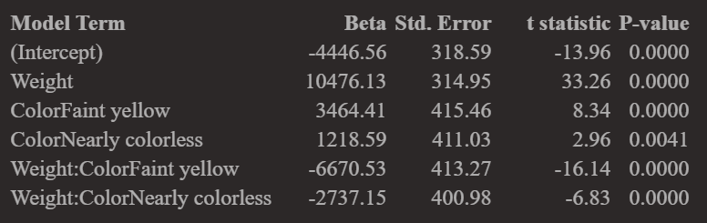
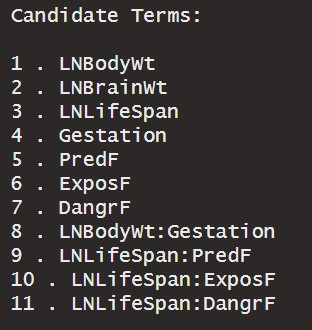
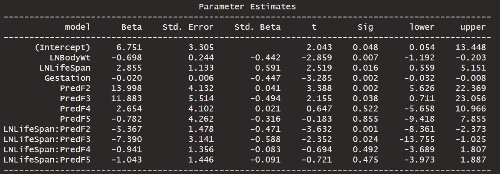

```{r setup, include=FALSE, echo=FALSE}
options(htmltools.dir.version = FALSE)
knitr::opts_chunk$set(
  fig.retina=2,
  #out.width = "75%",
  #out.height = "50%",
  htmltools.preserve.raw = FALSE,      # needed for windows
  scipen=100,                          # suppresses scientific notation
  getSymbols.warning4.0 = FALSE,       # suppresses getSymbols warnings
  cache = FALSE,
  echo = TRUE,
  hiline = TRUE,
  message = FALSE, 
  warning = FALSE
)


# install helper package (pacman)
# pacman loads and installs other packages, if needed
if (!require("pacman")) install.packages("pacman", repos = "http://lib.stat.cmu.edu/R/CRAN/")

# install and load required packages
# pacman should be first package in parentheses and then list others
pacman::p_load(pacman,tidyverse, magrittr, olsrr, gridExtra, ggiraphExtra, knitr, viridis)

# verify packages (comment out in finished documents)
p_loaded()


```

```{r xaringan-themer, include=FALSE, warning=FALSE}
library(xaringanthemer)

palette <- c(
  SU_Orange1        = "#F76900",
  SU_Orange2        = "#FF8E00",
  SU_Red_Orange     = "#FF431B",
  SU_Blue1          = "#000E54",
  SU_Blue2          = "#203299",
  SU_Light_Blue     = "#2B72D7",
  SU_White          = "#FFFFFF",
  SU_Light_Gray     = "#ADB3B8",
  SU_Medium_Gray    = "#707780",
  SU_Black          = "#000000", 
  
  steel_blue        = "#4682B4",
  corn_flower_blue  = "#6495ED",
  deep_sky_blue     = "#00BFFF",
  dark_magenta      = "#8B008B",
  medium_orchid     = "#BA55D3",
  lime_green        = "#32CD32",
  light_sea_green   = "#20B2AA",
  chartreuse        = "#7FFF00",
  orange_red        = "#FF4500",
  white_smoke       = "#F5F5F5",
  dark_cyan         = "#008B8B",
  light_steel_blue  = "#B0C4DE",
  indigo            = "#4B0082",
  ivory             = "#FFFFF0",
  light_slate_grey  = "#778899",
  linen             = "#FAF0E6",
  steel_blue        = "#4682B4",
  blue_violet       = "#8A2BE2",
  dodger_blue       = "#1E90FF",
  light_blue        = "#ADD8E6",
  azure             = "#F0FFFF",
  lavender          = "#E6E6FA")

primary_color = "#4682B4"                # steel_blue
secondary_color = "#778899"              # light_slate_grey
white_color = "#FFFFF0"                  # ivory
black_color = "#000080"                  # navy

style_duo_accent(
  primary_color = primary_color,
  secondary_color = secondary_color,
  white_color = white_color,
  black_color = black_color,
  text_color = black_color,
  header_color = primary_color,
  background_color = white_color,
  code_inline_background_color = "#E6E6FA", # lavender
  link_color = "#1E90FF",                   # dodger_blue
  code_inline_color = "#4B0082",            # indigo
  text_bold_color = "#8B008B",              # dark_magenta
  header_font_google = google_font("Open Sans"),
  text_font_google = google_font("Open Sans"),
  code_font_google = google_font("Source Code Pro"),
  colors = palette
)


```

```{r xaringan-panelset, echo=FALSE}
xaringanExtra::use_panelset()
```

```{r xaringan-tile-view, echo=FALSE}
xaringanExtra::use_tile_view()
```

```{r xaringan-fit-screen, echo=FALSE}
xaringanExtra::use_fit_screen()
```

```{r xaringan-tachyons, echo=FALSE}
xaringanExtra::use_tachyons()
```

```{r xaringan-animate-css, echo=FALSE}
xaringanExtra::use_animate_css()
```

```{r xaringan-animate-all, echo=FALSE}
#xaringanExtra::use_animate_all("slide_up")
```

background-image: url("docs_files/images/sloth_faded.png")
background-size: cover

class: bottom, right

## BUA 345 - Lecture 15

### Model Selection Continued

<br>


#### Penelope Pooler Eisenbies

#### `r Sys.Date()`

[Wikipedia Sloth Page](https://en.wikipedia.org/wiki/Sloth)

---

### Upcoming Dates

.pull-left[

### Upcoming Dates

- **HW 7 is due on Monday, 3/20**. 

   - Grace Period is extended until Wednesday 3/22 at midnight, because of Spring Break.
   
<br>
  
- **Quiz 2 is Thursday, March 30th**

- Today's Lecture (3/9) will include:

  - In-class Exercises using the Animals Data and your HW 7 data to help you make progress.

  - We will also introduce a new dataset about Wine.

]

.pull-right[

```{r owl pic, echo=FALSE}

knitr::include_graphics("docs_files/images/owl.png")

```

]

---

### Getting Started with Markdown

- Download Zipped R project 

- Open Zipped folder and copy internal folder (R Project) to a BUA 345 folder on your computer NOT IN DOWLOADS

- Click on .Rproj file to open project

- Click on `code_data_output` file to open it.

- Click on `BUA_345_Lecture_15.Rmd` to open it.

- Run Setup Chunk

---

### Setup

* The setup chunk shows the packages needed for this demo.   

* R will install specified packages if needed (only required once after R is installed)  

* R will load specified packaged (required every time you start a new R session)  

* The first time you run this code, R will install these packages which will be slow.  

* **If you get warnings, that's okay.**  

* If you get **error messages**, I (or TA), can help you.

---

### Setup Chunk for Lecture 15

```{r setup for Lecture 15, include = T}

# this line specifies options for default options for all R Chunks
knitr::opts_chunk$set(echo=T, highlight=T)
# suppress scientific notation
options(scipen=100)

# install helper package that loads and installs other packages, if needed
if (!require("pacman")) install.packages("pacman", repos = "http://lib.stat.cmu.edu/R/CRAN/")

# install and load required packages
pacman::p_load(pacman,tidyverse, magrittr, olsrr, gridExtra, ggiraphExtra, knitr, viridis)

# verify packages
p_loaded()

```

**NOTES:

- ** Don't worry about `xaringanthemer` package (required for my slides but not for your code).

- If you are having trouble installing/loading any packages, please come to office hour or make an appointment with me or course TA.

---

### Lecture 15 In-class Exercises - Review Question

#### **Question 1 (L15) - Session ID: bua345s23**

Review Question from HW 6: Recall the 'Diamonds' data.
The Categorical variable, 'Color', has THREE categories:

- `Colorless`
- `Nearly Colorless`
- `Faint yellow`

By default, R chooses a BASELINE category by alphabetical order.

Based on the output shown below, what is the SLR slope for the BASELINE category, 'Colorless' Diamonds?

Recall that the BASELINE category name does not appear in the regression output.

```{r diamonds model param estimates, echo=F}



```


---

### Review/New Question - Using A Model to get Estimates
#### Animals Data - Predicting Animal Sleep Duration

- Original dataset includes 56 distinct species, including man.

- Notes:

  - Two species of elephants were removed from the analysis.
  
    - Population was limited to animals under 1000 pounds.

  - Natural log (LN) transformed variables were added to original data.
  - Observations with missing values are removed below
  - Working dataset has 49 observations (49 different species)

```{r import data and remove missing values}

# import and examine data
animals <- read_csv("animals.csv", show_col_types=F) |>
  filter(!is.na(LifeSpan) & !is.na(Gestation)) 

```

---

### Glimpse of Animals Data

```{r data glimpse}

animals |> glimpse(width=75)

```

---

### Animals Data Dictionary - Description of Variables

```{r animals data dictionary table, echo=F}

Variable <- names(animals)

Type <- c("Nominal", rep("Quantitative", 8), rep("Ordinal", 3))

Description <- c("Name of Species",
                 "Total Sleep = sum of slow wave and paradoxical sleep (hrs/day)",
                 "Average Body Weight in kilograms",
                 "Natural Log of Body Weight",
                 "Average Brain Weight in grams",
                 "Natural Log of Brain Weight",
                 "Maximum Life Span in years",
                 "Natural Log of Life Span",
                 "Gestation Time in days",
                 "Predation Index (1 = least likely to be preyed upon, 5 = most likely)",
                 "Sleep Exposure Index (1 = least exposed while sleeping, 5 = most exposed",
                 "Overall Danger Index (1 = least danger from other animals, 5 = most most danger")

(animal_data_dictionary = tibble (Variable, Type, Description) |>
  kable())

```

#### Intuitvely, there is likely to be redundancy between `Predation`, `Exposure`, and `Danger`.

---
.pull-left[

### Matrix of Scatterplots 

- Like correlation matrices, scatterplot matrices are a useful way to quickly examine all possible predictors.
- First let's look at untransformed quantitative variables.

  - Notice BodyWt, BrainWt, LifeSpan plots all show observations clustered in the corner.
  - That indicates that these dsitributions are skewed and should be log transformed.
  -   Could be verified with histograms

```{r matrix 1}

animal_mat1 <- animals |> select(TotalSleep, 
                                 BodyWt, 
                                 BrainWt, 
                                 LifeSpan, 
                                 Gestation)

```

]

.pull-right[

```{r scatterplot matrix 1, out.extra='style="background-color: #3D3D3D; padding:1px;"'}

pairs(animal_mat1)

```

]

---

.pull-left[

### Scatterplot Matrix of Transformed Variables

- Next is same matrix with the LN transformed variables.

- Notice that distributions look better BUT some variables are highly correlated

  - Recall: If $R_{XY} \geq 0.8$ for two variables, they cannot both be in the model because they are **multicollinear**.

  - `LNBodyWt` and `LNBrainWt` should definitely both NOT be in the final model.

  - `LNBrainWt` and `LNLifeSpan` appear close to the cutoff and should not be in the final model together, if possible.
  
```{r matrix 2}

animal_mat2 <- animals |> select(TotalSleep, 
                                 LNBodyWt, 
                                 LNBrainWt, 
                                 LNLifeSpan, 
                                 Gestation)

```

]

.pull-right[


```{r scatterplot matrix 2, out.extra='style="background-color: #3D3D3D; padding:1px;"'}

pairs(animal_mat2)

```

]

---

### Correlation Matrix of Transformed Variables

The correlation matrix shows the numerical values of the correlations we see in the scatterplot.

```{r correlation matrix 2}

animal_mat2 |> cor() |> round(2) |> kable()

```


---

.pull-left[

### Scatterplot Matrix of Ordinal Variables

Which two ordinal categorical predictor variables appear to be multicollinear, i.e., highly correlated?

```{r matrix 3}

animal_mat3 <- animals |> select(TotalSleep, 
                                 Predation, 
                                 Exposure, 
                                 Danger)

```

]


.pull-right[

```{r scatterplot matrix 3, out.width=350, out.extra='style="background-color: #3D3D3D; padding:1px;"'}

pairs(animal_mat3)

animal_mat3 |> cor() |> round(2)


```

]

---

### Backward Elimination

**`1.`** Data examination and transformations completed

**`2.`** Create a full 'saturated' model with all potential predictor variables and interaction terms (This is subjective).

```{r animals full model}

 # convert ordinal variables to factors
animals <- animals |>       
  mutate(PredF = factor(Predation), 
         ExposF = factor(Exposure), 
         DangrF=factor(Danger))

# full model (subjective)
animals_full <- lm(TotalSleep ~ LNBodyWt + LNBrainWt + 
                     LNLifeSpan + Gestation + 
                     PredF + ExposF + DangrF + 
                     LNBodyWt*Gestation + LNLifeSpan*PredF + 
                     LNLifeSpan*ExposF + LNLifeSpan*DangrF, data=animals)

```

---

### Backward Elimination

**`3.`** Use 'Backward Elimination' to pare full model down to a preliminary model.

- We cast a ***wide net*** to start by specifying that erms will remain in model if p-value < 0.1.  

```{r animals model backward elim and output, results='hide'}

(animals_BE <- ols_step_backward_p(animals_full, prem = 0.1, progress = T))

```

```{r BE candidate terms, echo=FALSE, out.height=200}



```

```{r BE elim summary, echo=FALSE}


```


---

### Backward Elimination - Preliminary Model  

- Note that each category of each factor variable is shown making model look more complex than it is.

```{r anaimals BE param table, echo=F, fig.align='center'}


```

---

### Backward Elimination - Next Steps

**`4.`** Examine predictors in preliminary model to confirm they are not too highly correlated with each other. 

- If correlation for two variables, $R_{XY} \geq 0.8$, then those two variables are **multicollinear** and one of the two variables should be excluded.

- Variables in preliminary model: : `LNBodyWt`, `LNLifeSpan`, `Gestation`, `PredF`, `DangrF`, `LNLifeSpan*PredF`

  - Recall that `PredF` (Predation) and `DangrF` (Danger) are highly correlated.
  - `PredF` is included in an interaction term so exclude `DangrF`.

**`5.`** If model was modified in Step 4, rerun model through Backward Elimination (not always needed).

**`6.`**  Interpret final model. 

- Adjusted R<sup>2</sup> = 0.655
- Model below looks complicated, but each animal is in only one Predation Category.
- Baseline Predation Category = 1


```{r final animal model, results='hide'}
# specify final model
(animals_final <- ols_regress(TotalSleep ~ LNBodyWt + LNLifeSpan + Gestation + 
                               PredF + LNLifeSpan*PredF, data=animals))
# save coefficients
animals_model <- animals_final$model

```


---

### Backwards Elimination - Animal Data Final Model

**Variables in Final Model: `LNBodyWt`, `LNLifeSpan`, `Gestation`, `PredF`, `LNLifeSpan*PredF`**

```{r animal final param table, echo=F, fig.align='center'}



```


---


### Using Model to Find Estimates - Exporting Model and Data to Excel

- This model can be used to find model estimates and residuals for all animals.

- We will **ALSO** do these calculations are done in an Excel Spreadsheet to clarify each model component in estimate.

- Below we export the data for three species to examine how the model works

```{r exporting data to excel for demo}
animals_model_data <- animals |>             # create new dataset with model variables only
  select(Species, TotalSleep, LNBodyWt, LNLifeSpan, Gestation, PredF)

three_species <- animals_model_data |>       # create mini dataset with three species
  filter(Species %in% c("Baboon", "Donkey", "ArcticFox")) |>
  write_csv("ThreeSpecies.csv")

```

```{r display exported data, echo=F}

three_species |> kable()

```

---

### Using Model to Find Estimates - Exporting Model and Data to Excel

.pull-left[


- Model coefficients for calculations can be extracted and exported to Excel.

- Below We create a two column dataset listing each model component and it's beta coefficient.

- That dataset is exported as a .csv file for an in-class exercise.

```{r export model betas}

# examine and export model betas for worksheet
beta <- animals_final$betas
model_term <- names(beta)
animal_betas <- tibble(model_term, beta) |> 
    write_csv("animal_betas.csv")

```

]

.pull-right[

```{r examine model betas table, echo=F}

animal_betas |> kable()

```

]

---

#### Lecture 15 In-class Exercises

#### **Question 2 (L15) - Session ID: bua345s23**

- What is the regression estimate of total sleep for 'Donkey'?

#### **Question 3 (L15) - Session ID: bua345s23**

- What is the regression estimate of total sleep for 'Artic Fox' (`ArticFox`)?

**Notes:** 
- Artic Fox is in Predation (`PredF`) category 1, the baseline category so the calculation is a little different.

- This is similar, but not identical, to finding the model for the `colorless` diamonds in HW6.

#### At Home Practice:

- Complete the worksheet for 'Baboon' at home.

- At least one question on Quiz 2 will include an Excel Worksheet like this where you have to correctly do the calculation using the model and x values from the data.

- You can use R, but that code will not be provided.

- This exercise is about understanding the model estimation process.


---

### Using Model to Find Estimates in R

- Model estimates can be calculated in R.

- The Excel Worksheet is used to demonstrate and clarify how those estimates are calculated.

- Students will be expected to calculate an estimate using a model with this level of complexity on Quiz 2.

```{r regression model estimates in R}
animals_model_data <- animals_model_data |>     # add model estimates to data
  mutate(Est_TotalSleep = lm(animals_model) |> 
           predict(animals_model_data) |> round(2))

animals_model_data <- animals_model_data |>          # calculate residuals
  mutate(Resid = TotalSleep - Est_TotalSleep) |>
  relocate(Est_TotalSleep, Resid, .after=TotalSleep) # reorder variables

head(animals_model_data, 4) |> kable()               # print first 4 rows

```

---

#### Model Validation

- How good is our model?
- There are many ways to examine model fit.
- Here are two straightforward ways:

  - Check correlation between observed and estimated values
  - Plot a scatterplot of observed and estimated values

```{r model validation}
animals_model_data |> select(TotalSleep, Est_TotalSleep) |> cor() |> round(2)

pred_plot <- animals_model_data |>       # plot code begins here
  ggplot() + 
  geom_point(aes(x=TotalSleep, y=Est_TotalSleep, color=PredF), size=5) +
  labs(x = "Observed Total Sleep", y = "Est. Total Sleep", color="Predation",
       title="Animals Model Validation Scatterplot") + 
  scale_color_viridis(discrete = T) +
  theme_classic() +
  theme(title = element_text(size=20),
        axis.title = element_text(size=18),
        axis.text = element_text(size=15),
        plot.background = element_rect(colour = "darkgrey", fill=NA, size=2))

```

---

### Model Validation Plot

```{r display of model validation scatterplot, echo=F, fig.align='center'}

pred_plot

```

---

### HW 7 Demo

- Students are provided with an R project to complete HW 7.

- Reach instruction which correspond to Blackboard Assignment.

- Run Chunk 1 (`setup`) and Chunk 2 (`import and examine ames dataset`).

- Chunk 3 (`examine correlation matrix of X variables`) is incomplete.

  - Remove # symbols before incomplete R code.
  - Replace blanks (`____`) with correct commands to calculate correlation matrix with values rounded to 2 decimal places.
  - Run line or whole chunk to view correlation matrix which is large.

- In Chunk 4 (`find maximum correlations in correlation matrix of X variables`):

  - Remove `#` before line that begins `max(cor_Xmat...` to find the maximum positive correlation.
  - Remove `#` before line that begins `min(cor_Xmat...` to find the maximum negative correlation.
  - Run whole chunk to fin the maximum positive and negative correlations.
  
- Run Chunk 5 (`specify full model and do backward elim`) to:

  - Create the full model with all variables and no interactions. 
  - Run the Backward Elimination.

---
  
### HW 7 Demo Continued
  
- Run Chunk 6 (`save final model`) to save the model as `final_ames_model`.

- In Chunk 7 (`import new data and add predictions`), you will run commands one at a time.

  - Run the first command  that begins `new_houses <- read_csv(...` to import a new small datset with 2 observations.

  - Run the command that begins `(new_houses <- new_houses |> mutate(Est_Price...` to add `Est_Price`, the regression estimates to this dataset.
  
  - Remove `#` before the following three lines to complete them:
 
`#(new_houses <- new_houses |> ` 

`#   mutate(Resid = ____ - ____ |> round()) |> `

`#   relocate(Est_Price, Resid, .after=Price)) `
      
    
  - In the line with the blanks you are calculating residuals as 
  
    - Price minus Estimated Price (`Resid = Price - Est_Price`) 
    
    - The next line relocates `Est_Price` and `Resid` in the left side of the dataset, after `Price`.

---

### Other Model Selection Methods

- Recall that in Multiple Linear Regression (MLR) the goal is to choose the simplest most accurate model, i.e. the 'BEST' set of independent variables

- How do we decide which variables should be in our model?

- There are many methods:

- We've discussed Backward Elimination which can also be done manually in any software (not recommended).

- **Backward Elimination** starts with all potential terms (including potential interaction terms) in the model and removes the least significant term for each step.

   - This is referred to as starting with a **full** or **saturated** model.

- **Forward Selection:** By default, this procedure starts with an empty model and adds the most significant term at each step until there are no more useful terms to add.

   -  Forward selection also needs to know what terms are in the **full** model.

- **Stepwise Selection:** By default, this procedure starts with an empty model and then adds or removes a term for each step.

- Common Practice: Try multiple methods to develop preliminary final model and then tweak as needed.

---

### Notes about Model Selection using Multiple Methods

.pull-left[

- These steps are similar to the steps for Backward Elimination.

- Not all steps are ALWAYS required. It depends on how complex the data are.

- In the following example, we only need to do part of Step 1 plus Steps 2, 3, and 6.

   -  For step 1, we only need to examine correlations.

   -  In this case, Step 7 will be apparent.

   -  We can add model estimates to data for future interpretation (Step 8)


]


.pull-right[

```{r owl pic2, echo=FALSE}

knitr::include_graphics("docs_files/images/owl.png")

```

]


---

### Steps for Model Selection Using Multiple Methods
                                    
**`1.`** Examine Matrix of Scatterplots and histograms and determine if any transformations are needed to linearize relationships between continuous predictors and response variable.

  - Also look at correlation matrix to check if there are pairs of variables to be concerned about.

**`2.`** Create a 'saturated' model with all potential predictor variables and interaction terms (Subjective!).

**`3.`**  Use **Backward Elimination**, **Forward Selection**, and **Stepwise Selection** to find preliminary candidate models. (These are automated procedures!)

  - Carefully examine results to see where these candidate models agree and disagree.

**`4.`** Examine predictors in preliminary candidate models to confirm they are not too highly correlated with each other.

  - If two predictor variables in any model have a correlation of 0.8 or greater, drop one of them.

**`5.`**  Rerun model selection methods, if a candidate model is substantially changed (not always needed).

**`6.`**  Compare model fit statistics from final candidate model from all three methods.

**`7.`**  Decide on final candidate and make final modifications, if needed.

**`8.`**  Interpret final model.

---

### Wine Data - Model Selection Example

.pull-left[

***Can we determine what factors affect wine quality even if we KNOW NOTHING about wine cultivation and chemistry?***

**Maybe!**

- Since we have no prior knowledge, we start with a straightforward full model with all available predictors and no interactions.

  - In practice, a consultant would be working with a wine expert to carefully determine a saturated model that includes all possible interactions.

]

.pull-right[

```{r beaver pic, echo=F}

knitr::include_graphics("docs_files/images/beaver.png")

```


]

---

### Import Wine Data

-   Notice that all variables are numeric (*`<dbl>`* stands for decimal value).

```{r import and examine data}

wine <- read_csv("wine.csv", show_col_types = F) |>
  glimpse()

```

---

### Examine Correlation matrix for MultiCollinearity 

```{r examine wine correlation matrix, results='hide', echo=F}
(cor_wine <- wine |> cor() |> round(2)) #  correlation matrix 
```

```{r show cor matrix image, echo=F}

```


```{r max of wine cor matrix}
max(cor_wine[cor_wine < 1])
```

---


### Model Selection

- We specify a full model using an esy shortcut:

   - If all variables are included, you can use `.` instead of listing them all.

- The we do three model selection procedures:

   - Backward Elimination (BE)
   - Forward Selection (FS)
   - Stepwise Selection (SS)

```{r specify full model}

wine_full <- lm(Wine_Quality ~ ., data = wine)                 # specify full model

wine_BE <- ols_step_backward_p(wine_full, progress=F)          # backward elimination  

wine_FS <- ols_step_forward_p(wine_full, progress=F)           # forward selection

wine_SS <- ols_step_both_p(wine_full, progress=F)              # stepwise selection

```

---

#### Comparing Model Results

- Look at the LAST step for each method to determine which method results in the best fit.

- Comparison Measures:

  - **Adj. R<sup>2</sup>:** Higher value indicates better model fit

  - **C(p):** Lower value indicates better model fit (Also referred to as Mallow's C(p)).

  - **AIC:** Lower value indicates better model fit (Akaike Information Criteria).

  - **RMSE:** Lower value indicates better model fit (Root mean Square Error).

- By comparing these measures and accounting for our understanding of these procedures, we can determine that **TWO** of these methods arrived at the same model.

### Lecture 15 In-class Exercises

#### **Question 4 (L15) - Session ID: bua345s23**

Which two model selection methods arrived at the same model for the wine data?

---
#### Backwards Elimination & Forward Selection
```{r wine be fs, echo=F}
wine_BE
wine_FS

```

---

#### Backwards Elimination & Stepwise Selection
```{r wine be ss, echo=F}
wine_BE
wine_SS

```

---

#### Forward Selection & Stepwise Selection 
```{r wine fs ss, echo=F}
wine_FS
wine_SS

```

---

### Model Validation

```{r saving and examining final model results}

# create final model dataset save model
wine_model_data <- wine |> 
  select(!c("Residual_Sugar","Fixed_Acidity","Citric_Acidity"))

# create save final model
wine_model_final <- ols_regress(Wine_Quality ~ ., data=wine_model_data)
wine_model <- wine_model_final$model

# add final model estimates and residuals to dataset
wine_model_data <- wine_model_data |>   
  mutate(Est_Wine_Quality = lm(wine_model) |> predict(wine_model_data) |> round(2))

# calculate correlation between observed and estimated wine quality
wine_model_data |> select(Wine_Quality, Est_Wine_Quality) |> cor() |> round(2)

```

```{r plot code for model validation plot, echo=F}

pred_plot <- wine_model_data |>         # create model vaildation plot
  ggplot(aes(x=Wine_Quality, y=Est_Wine_Quality, color=Alcohol)) + 
  geom_point() +
  labs(x = "Wine Quality", y = "Est. Wine Quality", color="Alcohol %",
       "Wine Model Validation Plot") + 
  scale_color_viridis() +
  geom_jitter(width=0.1) +
  theme_classic() +
  theme(title = element_text(size=20),
        axis.title = element_text(size=18),
        axis.text = element_text(size=15),
        plot.background = element_rect(colour = "darkgrey", fill=NA, size=2))
```

---

### Model Validation Plot

```{r display of wine model validation scatterplot, echo=F, fig.align='center'}

pred_plot

```

---

background-image: url("docs_files/images/tired_panda_faded.png")
background-size: cover

.pull-left[

### **Key Points from Today**

.bg-azure.b--dark_cyan.ba.bw2.br3.shadow-5.ph2[

- Regression modeling can be overwhelming 

  - Automating part of the variable selection process is helpful.

  - Try different methods and compare results.

  - Results from automated processes are preliminary.

  - Model estimates and residuals can be added to dataset.

  - Demonstrated for both datasets and in HW 7.
  
***HAVE A GREAT BREAK!***

]

]

.pull-right[

.bg-azure.b--dark_cyan.ba.bw2.br3.shadow-5.ph3[
You may submit an 'Engagement Question' about each lecture until midnight on the day of the lecture. **A minimum of four submissions are required during the semester.**
]

]


